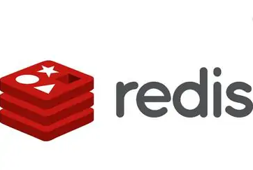

# Redis入门

本文浅述Redis。

包括且不限于：

+ NoSQL数据库概述
+ Redis数据库概述、安装
+ Redis常用5大数据类型
+ Redis 6 的新数据类型
+ Redis配置文件介绍
+ Redis的持久化
+ Redis集群、主从复制、哨兵模式
+ Redis应用问题（缓存穿透、缓存击穿、缓存雪崩..）

点击下方图片查看：

<a href="Redis.md" target="_blank"></img></a>

